# KẾ HOẠCH CHI TIẾT 3 TUẦN THỰC HIỆN ĐỀ TÀI 04
## Nền Tảng Đánh Giá & Review Địa Điểm Du Lịch / Ăn Uống (MongoDB)

---

## 🎯 BẢNG BAREM ĐÁNH GIÁ CHI TIẾT & PHÂN CÔNG (THANG ĐIỂM 10.0)

| STT | Hạng Mục Đánh Giá | Điểm | SV Phụ Trách Chính | Sản Phẩm Đầu Ra |
| :--- | :--- | :--- | :--- | :--- |
| **1** | **Báo cáo & Thiết kế CSDL** | **2.5đ** | **SV1** | - Phân tích ưu thế MongoDB (1.0đ)<br>- Bản vẽ Schema nhúng `reviews` & `replies` (1.5đ) |
| **2** | **Chức năng CRUD Nền tảng** | **2.5đ** | **SV1** | API CRUD Địa điểm, Đăng bài đánh giá, Gửi bình luận |
| **3** | **Chức năng Nâng cao Đặc trưng** | **2.5đ** | **SV2** | - Text Index + Geospatial Index (`2dsphere`) tìm kiếm từ khóa & vị trí<br>- Aggregation Pipeline tính Rating Real-time & Top 10 |
| **4** | **Kiểm thử Hiệu năng & Demo Sống** | **2.5đ** | **SV3** | - Nạp 100 Document mẫu (5-15 reviews/doc) (1.0đ)<br>- Script Test tải & Demo sống 3 bước trơn tru (1.5đ) |
| **TỔNG** | **MỤC TIÊU ĐẠT TỐI ĐA BAREM** | **10.0đ** | **CẢ NHÓM 3 SV** | **QUYỂN BÁO CÁO + SOURCE CODE + DEMO SỐNG** |

---

## 🏗️ PHẦN 1: SCHEMA CSDL MONGODB CHUẨN (HỖ TRỢ TÌM KIẾM GEOSPATIAL & TEXT)

Database: `review_travel_db` | Collection: `locations`

```json
{
  "_id": ObjectId("650123456789abcdef012345"),
  "name": "InterContinental Danang Sun Peninsula Resort",
  "category": "Nghỉ dưỡng",
  "address": "Bán đảo Sơn Trà, TP. Đà Nẵng",
  "city": "Đà Nẵng",
  "location": {
    "type": "Point",
    "coordinates": [108.3065, 16.1215]
  },
  "images": [
    "https://example.com/img1.jpg",
    "https://example.com/img2.jpg"
  ],
  "description": "Khu nghỉ dưỡng sang trọng bậc nhất bên bờ biển Sơn Trà.",
  "price_range": "LUXURY",
  "rating_avg": 4.8,
  "total_reviews": 12,
  "created_at": ISODate("2026-09-01T00:00:00Z"),
  "reviews": [
    {
      "review_id": ObjectId("650123456789abcdef012399"),
      "user_name": "Huỳnh Văn Ngọc",
      "avatar": "https://example.com/user1.jpg",
      "rating": 5,
      "content": "Khách sạn đẹp xuất sắc, dịch vụ 5 sao phục vụ rất tận tình!",
      "images": ["https://example.com/rev1.jpg"],
      "created_at": ISODate("2026-09-15T10:30:00Z"),
      "replies": [
        {
          "reply_id": ObjectId("650123456789abcdef012400"),
          "user_name": "Ban Quản Lý InterContinental",
          "content": "Cảm ơn bạn Ngọc đã dành thời gian đánh giá!",
          "created_at": ISODate("2026-09-15T11:00:00Z")
        }
      ]
    }
  ]
}
```

---

## 📅 PHẦN 2: LỘ TRÌNH CHI TIẾT TỪNG TUẦN (WEEKLY ROADMAP)

```mermaid
flowchart LR
    subgraph W1 ["TUẦN 1: Database Schema, GeoJSON, 100 Docs & CRUD API"]
        direction TB
        A1["SV1: Schema Mongoose GeoJSON & Base CRUD API"]
        A2["SV2: Cài MongoDB & Viết Index Cơ Bản"]
        A3["SV3: Nạp 100 Địa Điểm Mẫu (Toạ Độ Lat/Lng + Reviews)"]
    end

    subgraph W2 ["TUẦN 2: Aggregation Real-time, 2dsphere Index & UI Web"]
        direction TB
        B1["SV1: API Reviews & Replies Lồng Nhau"]
        B2["SV2: Aggregation Rating Real-time + 2dsphere/Text Index"]
        B3["SV3: Dựng UI Web Mạng Xã Hội Review & Tìm Theo Vị Trí"]
    end

    subgraph W3 ["TUẦN 3: Test Tải, Báo Cáo & Demo Sống"]
        direction TB
        C1["SV1: Báo Cáo Phân Tích MongoDB (2.5đ)"]
        C2["SV2: Báo Cáo Query/Index Geospatial/Aggregation"]
        C3["SV3: Script Test Tải & Tập Demo 3 Bước"]
    end

    W1 --> W2 --> W3
```



---

### 🔴 TUẦN 1: THIẾT KẾ SCHEMA (CÓ GEOJSON), NẠP 100 DỮ LIỆU MẪU & VIẾT API CRUD

> **Mục tiêu Tuần 1**: Chốt Schema Mongoose nhúng mảng & hỗ trợ GeoJSON `Point`, nạp **100 Document địa điểm** có tọa độ thực tế và hoàn thành các API CRUD cơ bản.

#### 📆 Chi Tiết Từng Ngày (Tuần 1)
* **Ngày 1 (Thứ 2)**:
  * **Cả nhóm**: Chốt stack công nghệ (Node.js/Express + Mongoose + MongoDB Compass + HTML/TailwindCSS hoặc React/WPF).
  * **SV1 (Data Architect & CRUD Lead)**: Khởi tạo project Backend, cấu hình file `models/Location.js` hỗ trợ GeoJSON Point (`location: { type: String, coordinates: [Number] }`) cùng mảng nhúng `reviews` và `replies`.
  * **SV2 (Advanced Query Specialist)**: Cài đặt MongoDB Server 7.0+, tạo Database `review_travel_db`.
  * **SV3 (Fullstack Integrator & DB Tester)**: Chuẩn bị danh sách 100 địa điểm kèm tọa độ GPS (Kinh độ/Vĩ độ) thực tế tại Đà Nẵng, Hà Nội, TP.HCM.

* **Ngày 2 (Thứ 3)**:
  * **SV1**: Kết nối Backend với MongoDB. Viết API `POST /api/locations` (Thêm mới địa điểm) và `GET /api/locations` (Danh sách phân trang).
  * **SV2**: Tạo Text Index & Geospatial Index trong MongoDB CLI:
    ```javascript
    db.locations.createIndex({ name: "text", description: "text", category: "text" });
    db.locations.createIndex({ location: "2dsphere" });
    ```
  * **SV3**: Viết script `seedData.js` tự động sinh 100 Document địa điểm kèm tọa độ GeoJSON `[longitude, latitude]` và mảng nhúng từ 5-15 review ngẫu nhiên.

* **Ngày 3 (Thứ 4)**:
  * **SV1**: Viết API `GET /api/locations/:id` (Xem chi tiết) và `PUT /api/locations/:id` (Cập nhật địa điểm).
  * **SV2**: Kiểm tra cấu trúc các document sau khi seed, đảm bảo trường `rating_avg`, `total_reviews` và tọa độ `location` chuẩn format GeoJSON.
  * **SV3**: Chạy `seedData.js` nạp thành công **100 Document** vào MongoDB. Mở **MongoDB Compass** kiểm tra mảng lồng nhau và vị trí địa lý.

* **Ngày 4 (Thứ 5)**:
  * **SV1**: Viết API `DELETE /api/locations/:id` (Xóa địa điểm).
  * **SV2**: Viết Compound Index cho lọc theo Thành phố và Thể loại: `db.locations.createIndex({ city: 1, category: 1 })`.
  * **SV3**: Đóng gói Postman Collection kiểm thử toàn bộ API CRUD Địa điểm.

* **Ngày 5 - 7 (Thứ 6 - Chủ Nhật)**:
  * **SV1**: Viết API `POST /api/locations/:id/reviews` (Thêm bài đánh giá 1-5 sao mới).
  * **SV3**: Thiết kế Mockup giao diện Web/App tĩnh. Họp review tổng kết Tuần 1.

📌 **Sản Phẩm Đầu Ra Tuần 1**:
- CSDL MongoDB có **100 Document mẫu** đầy đủ reviews và tọa độ GPS trên Compass.
- Bộ API CRUD Địa điểm chạy thông suốt trên Postman.

---

### 🟡 TUẦN 2: AGGREGATION PIPELINE REAL-TIME, TÌM KIẾM THEO VỊ TRÍ (GEOSPATIAL) & TÍCH HỢP UI WEB

> **Mục tiêu Tuần 2**: Hoàn thiện thuật toán **Aggregation Pipeline** tự động tính lại Rating Trung Bình real-time khi có review mới, xây dựng tìm kiếm theo từ khóa (Text Index) và vị trí bán kính (`$near` / `$geoNear`), dựng Giao diện Web Mạng Xã Hội Review.

#### 📆 Chi Tiết Từng Ngày (Tuần 2)
* **Ngày 8 (Thứ 2)**:
  * **SV2**: Xây dựng **MongoDB Aggregation Pipeline** tính điểm trung bình `rating_avg` và tổng số review `total_reviews` thời gian thực:
    ```javascript
    const result = await Location.aggregate([
      { $match: { _id: new mongoose.Types.ObjectId(locationId) } },
      { $unwind: "$reviews" },
      {
        $group: {
          _id: "$_id",
          avgRating: { $avg: "$reviews.rating" },
          totalReviews: { $sum: 1 }
        }
      }
    ]);
    ```
  * **SV1**: Kết nối API thêm review (`POST /api/locations/:id/reviews`) với hàm Aggregation của SV2 để tự động dùng `$set` cập nhật `rating_avg` vào Document địa điểm.
  * **SV3**: Thiết kế Form gửi Đánh giá (chọn 1-5 sao, gõ nhận xét, đính kèm ảnh) trên Web/App.

* **Ngày 9 (Thứ 3)**:
  * **SV2**: Viết Aggregation Pipeline lọc **Top 10 Địa điểm nổi bật có rating cao nhất**:
    ```javascript
    db.locations.aggregate([
      { $match: { total_reviews: { $gte: 5 } } },
      { $sort: { rating_avg: -1, total_reviews: -1 } },
      { $limit: 10 }
    ]);
    ```
  * **SV1**: Viết API `GET /api/locations/top10` trả về danh sách Top 10.
  * **SV3**: Thiết kế Component "Top 10 Địa Điểm Hot Nhất" trên Trang chủ Web.

* **Ngày 10 (Thứ 4)**:
  * **SV2**: Viết API Tìm kiếm địa điểm theo Vị trí (bán kính R km) sử dụng Geospatial Index (`2dsphere`):
    ```javascript
    // Tìm các địa điểm cách vị trí người dùng [lng, lat] trong bán kính 5000m (5km)
    db.locations.find({
      location: {
        $near: {
          $geometry: { type: "Point", coordinates: [lng, lat] },
          $maxDistance: 5000
        }
      }
    });
    ```
  * **SV1**: Viết API `POST /api/locations/:id/reviews/:reviewId/replies` (Thêm bình luận phản hồi lồng bên trong 1 review).
  * **SV3**: Thêm ô Tìm kiếm Từ khóa & Nút "Tìm Địa Điểm Gần Đây" trên Web.

* **Ngày 11 - 14 (Thứ 5 - Chủ Nhật)**:
  * **SV1 & SV2**: Kiểm tra lại toàn bộ logic: Khi gửi/xóa 1 review $\rightarrow$ điểm `rating_avg` trên CSDL tự động nhảy đúng.
  * **SV3**: Ghép nối hoàn chỉnh Giao diện Web. Họp review tổng kết Tuần 2.

📌 **Sản Phẩm Đầu Ra Tuần 2**:
- Giao diện Web Mạng xã hội Review kết nối API chạy mượt mà.
- Aggregation Pipeline tính điểm Rating Real-time & Top 10 chuẩn xác.
- Chức năng tìm kiếm Text Index & Tìm theo Vị trí Geospatial (`2dsphere`) hoạt động 100%.

---

### 🟢 TUẦN 3: KIỂM THỬ HIỆU NĂNG, ĐÓNG GÓI BÁO CÁO & TẬP DƯỢT DEMO SỐNG

> **Mục tiêu Tuần 3**: Chạy script test tải (Load Testing), viết hoàn thiện quyển Báo cáo thuyết minh Word/PDF và tập dượt Kịch bản Demo bảo vệ 3 bước trước giảng viên.

#### 📆 Chi Tiết Từng Ngày (Tuần 3)
* **Ngày 15 (Thứ 2)**:
  * **SV3**: Viết script test tải (giả lập 50–100 luồng gửi đánh giá đồng thời vào MongoDB) để đo thời gian phản hồi (Response Time) và độ ổn định.
  * **SV1**: Viết Chương 1 Báo cáo: Tổng quan hệ thống, phân tích ưu thế của MongoDB Document Store (lưu trữ phi cấu trúc, nhúng mảng lồng nhau không cần JOIN).
  * **SV2**: Viết Chương 2 Báo cáo: Thiết kế Schema CSDL `locations`, mảng `reviews` & `replies`, định dạng GeoJSON `location`.

* **Ngày 16 (Thứ 3)**:
  * **SV1**: Viết Chương 3 Báo cáo: Đồ họa các màn hình chức năng CRUD.
  * **SV2**: Viết Chương 4 Báo cáo: Thuyết minh chi tiết **Aggregation Pipeline**, **Text Index**, **Compound Index** & **Geospatial Index (`2dsphere`)**.
  * **SV3**: Viết Chương 5 Báo cáo: Kết quả kiểm thử hiệu năng & biểu đồ đo thời gian phản hồi.

* **Ngày 17 (Thứ 4)**:
  * **SV3**: Làm Slide thuyết trình PowerPoint/Canva (15–20 slide) + Quay 1 Video Demo backup (3–5 phút).
  * **SV1 & SV2**: Chuẩn hóa định dạng Báo cáo Word/PDF (Mục lục, hình ảnh, bìa).

* **Ngày 18 - 21 (Thứ 5 - Chủ Nhật)**:
  * **Cả nhóm**: **Tập dượt Kịch bản Demo Sống (Bám sát barem)**:
    1. *Bước 1 (SV1)*: Mở Web gửi 1 bài review **1 sao** hoặc **5 sao** mới cho địa điểm.
    2. *Bước 2 (SV2)*: Mở **MongoDB Compass** chỉ ra mảng `reviews` được chèn thêm phần tử mới + Chỉ ra điểm `rating_avg` trên Web lập tức thay đổi nhờ **Aggregation**.
    3. *Bước 3 (SV3)*: Demo 2 tính năng tìm kiếm:
       - Tìm từ khóa (Text Index): Gõ *"Resort biển"* $\rightarrow$ Kiểm tra kết quả.
       - Tìm theo Vị trí (Geospatial Index): Tìm địa điểm gần vị trí hiện tại trong bán kính 5km $\rightarrow$ Đối chiếu tọa độ `location` trong Compass.
  * In báo cáo, nộp bài và sẵn sàng bảo vệ chính thức!

---

## 🎯 BẢNG PHÂN CÔNG CHI TIẾT THEO BAREM (MỤC TIÊU TỐI ĐA BAREM)

| Sinh Viên | Hạng Mục Phụ Trách | Nhiệm Vụ Cụ Thể | Phân Chia Khối Lượng |
| :--- | :--- | :--- | :--- |
| **SV1** | **Data Architect & CRUD Lead** | - Viết Chương 1 & 3 Báo cáo Word (Phân tích MongoDB & CRUD)<br>- Thiết kế Mongoose Schema nhúng & GeoJSON<br>- Viết API CRUD Địa điểm, Reviews & Replies | **3.75 / 10đ** |
| **SV2** | **Advanced Query Specialist** | - Viết Chương 2 & 4 Báo cáo Word (Thuyết minh Schema & Truy vấn)<br>- Viết Aggregation Pipeline tính Rating Real-time & Top 10<br>- Xây dựng Text Index, Compound Index & **Geospatial Index (`2dsphere`)** | **3.75 / 10đ** |
| **SV3** | **Fullstack Integrator & DB Tester** | - Viết Chương 5 Báo cáo Word (Kiểm thử & Kết quả)<br>- Viết script nạp 100 Document dữ liệu mẫu (kèm Lat/Lng GPS)<br>- Dựng UI Web/App, chạy Test tải & Điều phối Demo sống | **2.5 / 10đ** |
| **TỔNG CỘNG** | **CẢ NHÓM 3 SV** | **HOÀN THÀNH 100% TIÊU CHÍ BAREM ĐỀ BÀI** | **10.0 / 10.0 ĐIỂM** |
